# PROYECTO GESTOR DE ACTIVIDADES USANDO LA METODOLOGIA SCRUM

El presente trabajo tiene como finalidad mostrar el proceso por medio del cual, basado en la metodología ágil SCRUM, se lleva a cabo la solución de un proyecto de desarrollo de software bajo esta modalidad de trabajo.

Al final observaremos como desarrollamos la primera iteración o el primer sprint con el cual generamos el primer incremento a la solución.

## 1. Descripción General de la Metodología

Tal y como lo explica la guía de Scrum, es un marco de trabajo, un framework por el cual las personas pueden abordar problemas complejos adaptativos, a la vez que entregan productos del máximo valor posible de forma productiva y creativa.

Scrum se basa en la teoría de control de procesos empírica o empirismo, que asegura que el conocimiento procede de la experiencia y de tomar decisiones basándose en lo que se conoce.

El plan del sprint es creado por todos los miembros del equipo Scrum de forma colaborativa. En esta ceremonia se toman todas las historias de usuario priorizadas y se decide sobre cuáles hacer el Sprint tomando como base el objetivo del sprint y la capacidad del equipo. Se define qué puede entregarse en el Incremento resultante del Sprint que comienza y cómo se conseguirá hacer el trabajo necesario para entregar el Incremento. Si bien Scrum no establece un método para estimar es recomendable utilizar alguno, como por ejemplo, la estimación en puntos de historia para cada uno de los elementos del sprint backlog.

## 2. Requerimiento

Desarrollar un formulario web en el cual sea posible asignar actividades a un equipo de trabajo de trabajo asignando el proyecto, módulo, integrantes del grupo de trabajo, y fecha de entrega de la actividad asignada.

## 3. Personas y roles del Proyecto

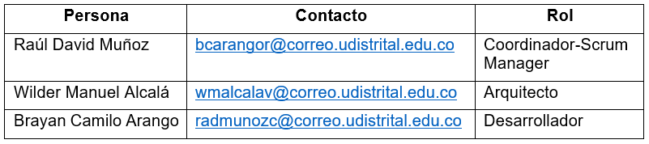

## 4. Artefactos

### Pila del Producto

A continuación se define la lista de requisitos o requerimientos funcionales que debe cumplir el sistema de acuerdo a la solicitud del cliente.

El requisito principal del proyecto es crear, buscar, actualizar y eliminar los registros.

- Crear Registros: Permite crear un nuevo registro de actividades asignando un grupo de trabajo, módulo, proyecto, descripción de la actividad y fecha de entrega.

- Consultar Registros: Permitir la consulta de las actividades almacenadas en la base de datos.

- Actualizar Registros: Permitir la actualización la información de cada actividad siempre y cuando se encuentre vigente.

- Eliminar Registros: Permitir eliminar registros (actividades, equipos de trabajo y/o proyectos) de la base de datos.

### Pila del Sprint

En esta sección se describe de forma detallada los requisitos o tareas que va a desarrollar el equipo de trabajo en cada iteración.

#### Responsabilidades del gestor de producto.

•	Presencia en las reuniones en las que el equipo elabora la pila del sprint. Resolución de dudas sobre las historias de usuario que se descomponen en la pila del sprint. 

#### Responsabilidades del Scrum Manager.

•	Supervisión y asesoría en la elaboración de la pila de la pila del sprint.

#### Responsabilidades del equipo técnico.

•	Elaboración de la pila del sprint. 
•	Resolución de dudas o comunicación de sugerencias sobre las historias de usuario con el gestor del producto.

### Primera Iteración – "First Sprint"

La primera fase del proyecto será desarrollar las actividades de inserción de datos (Creación de registros), para ello se han establecido las siguientes tareas con el fin de llegar al primer incremento del proyecto.

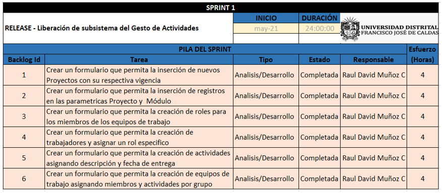

## 5. Incremento

Luego de asignar las tareas relacionadas con el módulo de inserción de datos del proyecto se obtiene el primer incremento, el cual consiste de todos los formularios con los cuales es posible agregar nueva información al gestor de actividades.

### Módulo de Proyectos

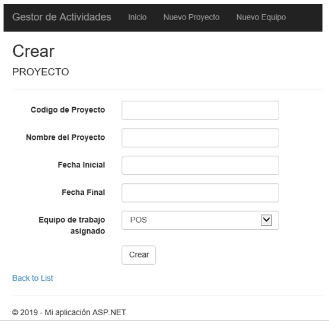

### Módulo de Equipos de Trabajo

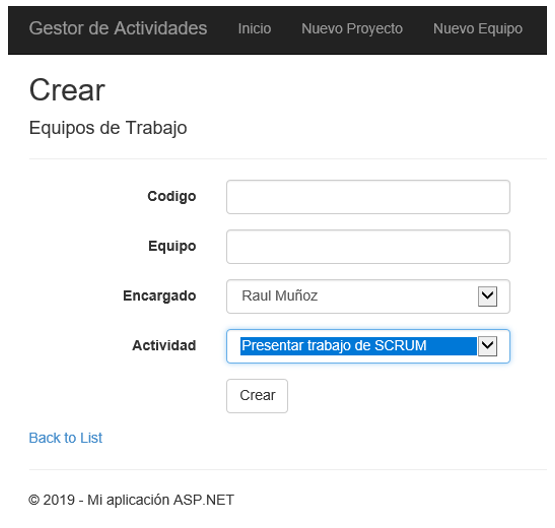

### Módulo de Actividades

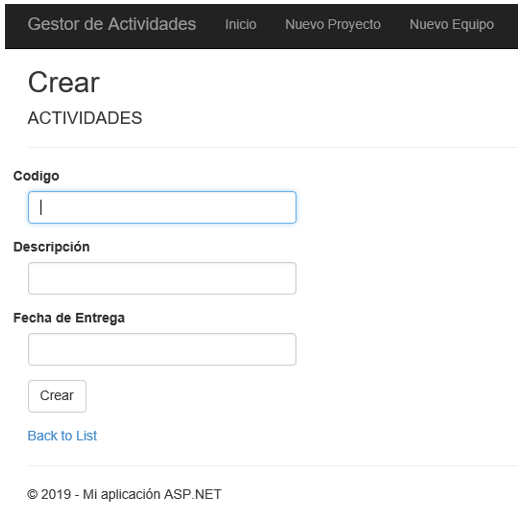

### Módulo de Miembros

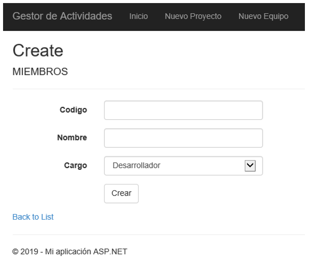

### Módulo de Roles

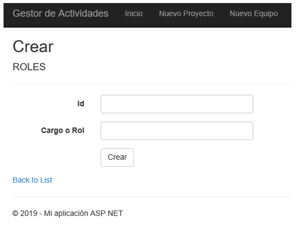

## 6. Pruebas 

Se crearon dos tipos de pruebas sobre uno de los módulos del proyecto, el de creación de Proyectos. Las pruebas implementadas son las siguientes:

### Pruebas Unitarias
Se realizó la creación de dos escenarios utilizando la herramienta que provee el Framework de desarrollo de Visual Studio 2017. Se realizó la creación de un proyecto de pruebas unitarias llamado Test_GestorActividades el cual contiene una clase llamada ProyectosTest.cs en el cual se agregaron dos métodos.

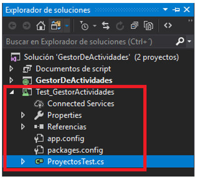

El primer método verifica la validez del formulario verificando que todos los campos se encuentren diligenciados.

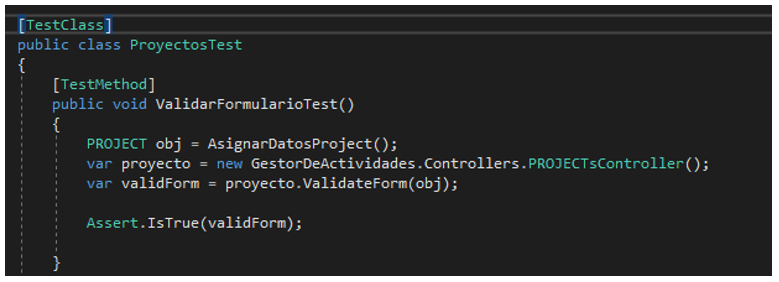

Al ejecutar la prueba enviando todos los parámetros el Test muestra un resultado exitoso

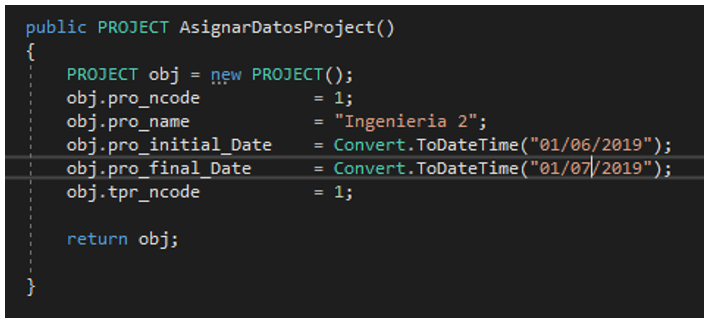

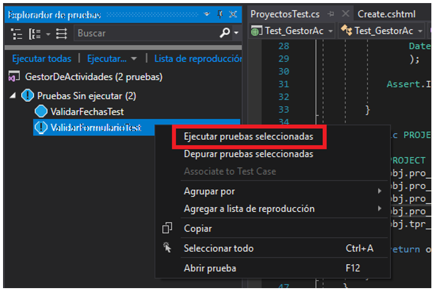

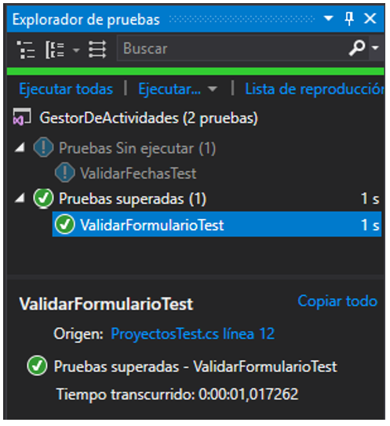

Al ejecutar la misma prueba pero enviando datos vacios se evidencia el resultado fallido del test.

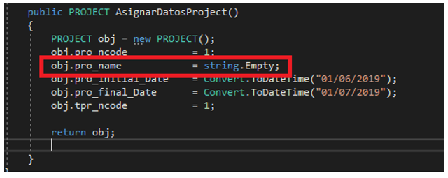

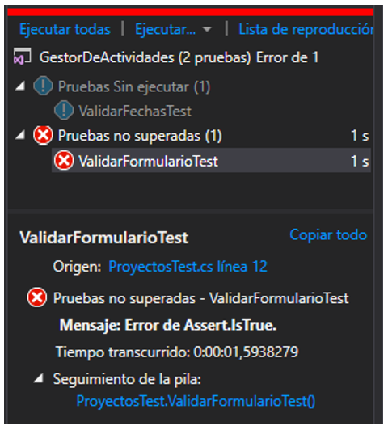

La siguiente prueba consiste en validar las fechas ingresadas, con el fin de evitar que se ingrese como fecha inicial del proyecto mayor a la fecha final, a continuación se muestran los dos escenarios:

#### Prueba Correcta

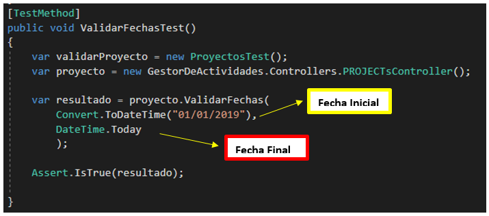

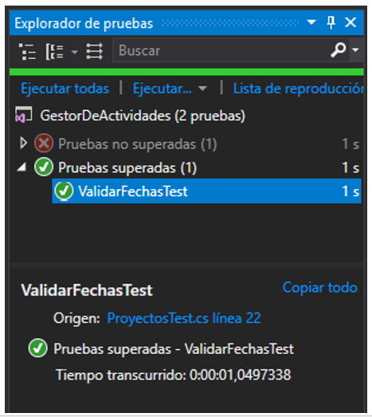

#### Prueba Errada

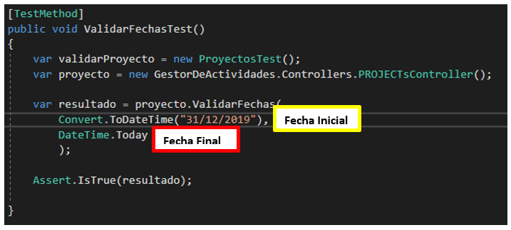

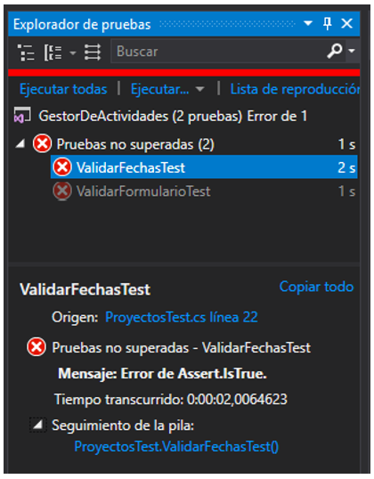

### Pruebas Automatizadas

Se realizó la creación de una prueba automatizada sobre el formulario de creación de un proyecto utilizando la herramienta Selenium implementado para el lenguaje C# de .NET.

Selenium es un entorno de pruebas de software para aplicaciones basadas en la web. Selenium provee una herramienta de grabar/reproducir para crear pruebas sin usar un lenguaje de scripting para pruebas (Selenium IDE). Incluye también un lenguaje específico de dominio para pruebas (Selanese) para escribir pruebas en un amplio número de lenguajes de programación populares incluyendo Java, C#, Ruby, Groovy, Perl, Php y Python. Las pruebas pueden ejecutarse entonces usando la mayoría de los navegadores web modernos en diferentes sistemas operativos como Windows, Linux y OSX.

La prueba consiste en lo siguiente:

1.	Por medio de un proyecto de consola C# agregando la utilidad de Selenium se genera un script el cual lanza la aplicación por medio de la URL en el navegador WEB.

2.	Una vez se acceda a la aplicación, es necesario capturar el id de cada elemento o atributo del formulario (textbox, botones, listas desplegables, etc…).

3.	A cada elemento capturado se envían los parámetros, datos, o eventos que se requieran para que el proceso de diligenciamiento del formulario y envió de este se realice de forma automática.

A continuación se muestra el script de ejemplo que se utilizó para esta prueba:

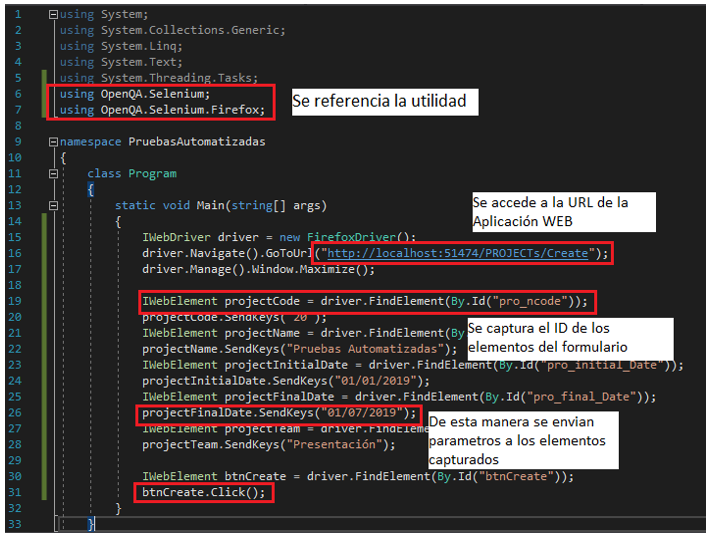

## 7. Sprint Review (Retrospectiva).

Después de haber concluido la primera iteración y luego de analizar los resultados de las pruebas aplicadas incremento se puede concluir que el incremento cumple con las especificaciones obtenidas pero se puede mejorar agregando validaciones dinámicas para hacer más intuitivo y amigable para el usuario la aplicación web.
